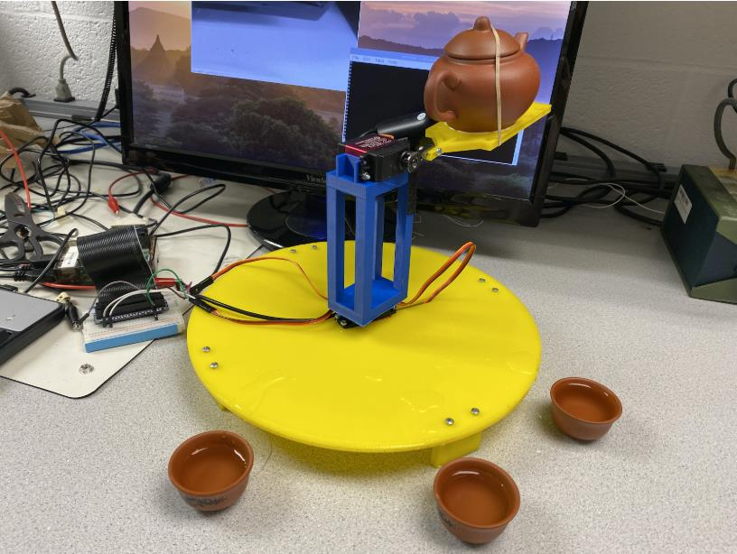
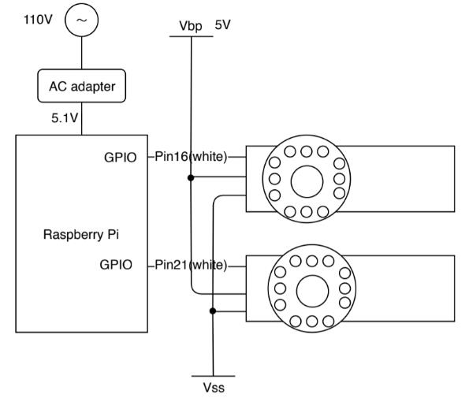
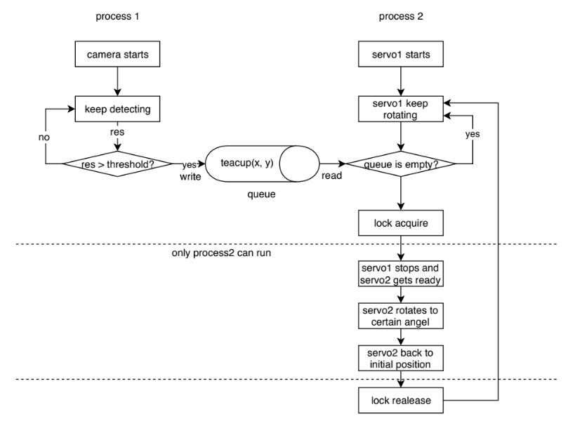

# ECE5725_tea_maker
<h1>Embedded Operating System course project. </h1>

<h2>Detect the teacups and automatically serve up to four cups of tea. </h2>

<h4>Actual Picture</h4>

<h4>Circuit Design</h4>

<h4>Work Flow</h4>

